# Simulador de Manobras Respiratórias Fisioterápicas

Este projeto visa criar um simulador de manobras respiratórias para treinamento acadêmico e clínico, com evolução contínua por semestres.

## Estrutura do Repositório

    /
    ├── docs/               # Formulários, relatórios e planos
    ├── hardware/           # CAD, esquemas e arquivos de protótipo
    ├── firmware/           # Código para microcontroladores
    ├── software/           # Dashboards e ferramentas de visualização
    ├── tests/              # Planos e resultados de testes
    └── assets/             # Diagramas, imagens e modelos 3D

## Versionamento de Branches

Adotamos a seguinte regra de branches para organizar o desenvolvimento ao longo dos semestres:

- **main**  
  Última versão estável e formalmente validada do protótipo.

- **semX-dev** (ex.: `sem1-dev`, `sem2-dev`)  
  Branchs de desenvolvimento para cada semestre.  
  1. Crie `semN-dev` a partir de `main` no início do semestre.  
  2. Todas as features e ajustes são feitos em branches de feature dentro de `semN-dev` (ex.: `feat/modelo-cad`).  
  3. Ao final do semestre, mescle `semN-dev` em `main` após revisão e testes.

## Framework do projeto

